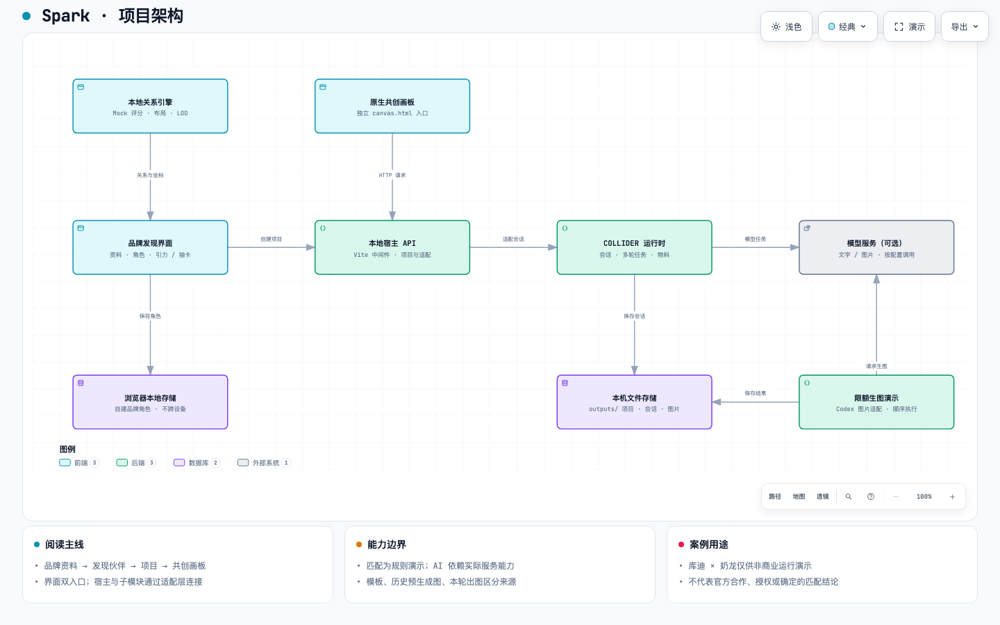
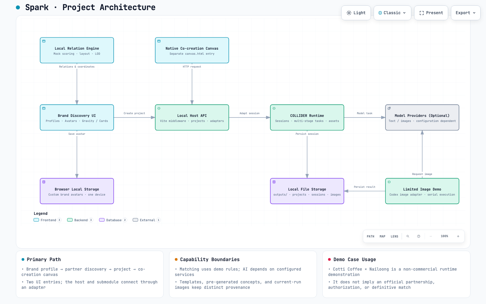

# Spark · 品牌发现与渠道共创演示

Spark 是一个从品牌资料出发，探索合作伙伴，再进入共创画板制作渠道预演的本地运行原型。它把「理解品牌—发现关系—表达合作意向—讨论与制作物料」串成可操作的演示流程。

项目使用 React、TypeScript 和 Vite，复用 COLLIDER 的原生画板与任务运行时。品牌关系发现目前采用确定性的 Mock 规则；资料理解、提案与图片生成按实际配置连接模型服务。项目尚未实现面向真实品牌的在线交易、邀约发送或多人协作平台。

## 产品目标与团队分工 / Product & ownership

**我希望验证：品牌合作能否从“看起来合适”走向可解释的合作假设，再形成可供讨论的提案。** Spark 将资料理解、关系探索与物料共创串在一个原型中；当前证明的是流程与能力边界，尚未证明真实品牌撮合效果或商业转化。

我是 [KAI](https://github.com/KAI-NEX)，主要负责项目目标、架构与产品逻辑、前端设计及实现推进。**除无限画布外，我参与了 Spark 的其余所有内容；无限画布由队友负责。** 参与其余内容不表示其余模块全部由我单独开发。画布及 COLLIDER 运行时的来源与复用保留在[整合说明](docs/COLLIDER-INTEGRATION.md)中；AI 工具辅助实现、测试和内容制作。

**My role:** product goals, architecture and product logic, and frontend design/delivery. I participated across the rest of Spark; a teammate built the infinite canvas. This is a collaborative project with AI-assisted implementation, not a claim that I authored every component. The next validation is a real brand/design team's proposal workflow, with review effort and usable outputs measured explicitly.

[阅读产品案例、关键取舍与个人贡献](docs/PRODUCT_CASE_STUDY.md)

## 架构图预览 / Architecture Preview

### 中文

[](output/architecture/2026-09-15/spark.html)

点击中文版截图可查看中文交互架构图；也可以打开 [中文架构图源文件](output/architecture/2026-09-15/spark.architecture.json)。

### English

[](output/architecture/2026-09-15/spark.en.html)

Click the English screenshot to open the fully interactive English architecture diagram. The viewer controls, component labels, relationship labels, legend, and summary cards are all in English. You can also inspect the [English diagram source](output/architecture/2026-09-15/spark.en.architecture.json).

完整代码证据与说明见 [详细架构说明](docs/ARCHITECTURE.md)。

> **案例用途声明：奶龙 × 库迪咖啡**
>
> 本仓库出现的奶龙、库迪咖啡及相关案例文件、角色、图片、文案与合作预演，仅用于项目介绍、学习交流和非商业功能演示，目的是展示项目流程可以运行；本项目未将该案例用于商业运营。
>
> 选择这两个品牌作为样例，不代表它们必然适合合作，不代表系统给出了确定、唯一或经过商业验证的匹配结论，也不代表双方存在本项目所描述的真实合作、授权、委托、认可或发布行为。案例中的资源安排、合作方式与视觉表现均应理解为演示设定。
>
> 相关品牌名称、商标、IP 和第三方素材的权利归各自权利人所有。本仓库的展示不构成对这些素材的商业使用授权。界面里的「建联」「双方确认」和导出状态也只是本地演示状态。

## 导航

- [项目要验证什么](#项目要验证什么)
- [运行与体验](#运行与体验)
- [系统架构](#系统架构)
- [关系匹配与引力布局](#关系匹配与引力布局)
- [项目、会话与画板](#项目会话与画板)
- [AI 功能与配置](#ai-功能与配置)
- [数据、素材与存储](#数据素材与存储)
- [开发验证与限制](#开发验证与限制)

配套产物：[中文交互架构图](output/architecture/2026-09-15/spark.html) · [English interactive architecture](output/architecture/2026-09-15/spark.en.html) · [代码证据与架构详解](docs/ARCHITECTURE.md)。架构 HTML 下载到本机后可直接用浏览器打开；GitHub 文件页不会直接运行其中的交互功能。

本文根据 **2026-09-15 的本地工作树**重新核对，包含当时尚未同步的画板生图演示实现。旧 README 原样保存在 [历史副本](docs/archive/README-before-2026-09-15.md)；历史记录中的能力、参数和测试数量不应当作当前版本说明。

## 项目要验证什么

品牌合作的第一步往往不是生成一张海报，而是先说清楚：自己有什么、希望获得什么、对方为什么愿意参与，以及双方能共同为消费者提供什么。

本项目将这一过程拆为四个连续环节：

1. **品牌资料与角色**：填写或上传资料，梳理能力、需求、受众、意图与视觉参考，把资料转成便于识别的品牌角色。
2. **伙伴发现**：通过引力关系场或抽卡浏览伙伴，查看合作线索、评分解释与待确认信息。
3. **合作项目**：选择伙伴后，保存双方资料、渠道简报及预演；「申请建联」在这里创建或打开本地项目。
4. **画板共创**：在原 COLLIDER 画板查看资料与素材，用对话进一步生成、修订和导出概念成果。

这条演示主线当前聚焦 **一对一渠道互荐**：A 方渠道沿用 A 方视觉，B 方渠道沿用 B 方视觉，合作方通过署名、内容和受众入口出现。默认简报约束不要求开发新商品，也不把两套视觉合并成新品牌。这是当前演示的设计范围，不是所有品牌合作必须遵守的唯一形式。

### 当前能做什么

| 能力 | 当前实现 | 应如何理解 |
| --- | --- | --- |
| 品牌资料录入 | 手动填写、预置资料、文档与图片上传 | 提取文字与 AI 理解是不同步骤 |
| 品牌角色 | 参数化角色、穿搭与配饰规则、图鉴、实验页 | 视觉强调不是经过认证的能力评分 |
| 引力匹配与抽卡 | 本地规则评分、解释与确定性布局 | 探索线索，不能当作合作预测 |
| 合作项目 | 本机文件保存、简报版本、邀请状态、预演与确认 | 不发送真实邀请，不跨设备同步 |
| 共创画板 | 直接接入 COLLIDER 界面、会话、物料与导出 | 可用功能取决于运行时与模型配置 |
| 渠道图片 | 模板、预载 AI 概念图、配置后的实时生成 | 必须保留来源及待确认标识 |
| 本机限额生图 | Codex 图片能力探测、队列、结果保存 | 独立演示通道，有固定演示预算 |

## 运行与体验

### 环境要求

以 [package.json](package.json) 为准：Node.js **24+**，pnpm **10.11.0**。完整运行需要 Git 子模块中的 COLLIDER 源码。

```sh
git clone --recurse-submodules https://github.com/KAI-NEX/Spark.git
cd Spark
pnpm install
pnpm dev
```

浏览器打开 `http://127.0.0.1:5173/`。开发服务绑定本机回环地址，配置了 `strictPort`；端口被占用时不会静默切到另一个端口。

已有检出如果缺少子模块：

```sh
git submodule sync --recursive
git submodule update --init --recursive
```

子模块路径为 `integrations/collider`，远端是同一个 GitHub 仓库的 `collider-integration` 分支。主仓库实际固定引用一个子模块提交，递归初始化会获取该提交，并非自动使用分支最新内容。有本地子模块改动时，应先核对状态再更新。

### 建议体验顺序

1. 首页进入品牌资料页，使用预置库迪资料或填写自己的品牌资料。
2. 确认品牌角色，进入引力匹配；也可以切换抽卡或打开图鉴。
3. 查看伙伴详情，理解分数、合作方向与缺口提示。
4. 点击申请建联，进入合作画板。
5. 查看双方资料及渠道预演。配置 AI 后，可主动提交生成或修订要求。
6. 返回项目列表，再次打开已保存项目，检查资料、会话及素材是否恢复。

无需实时生图即可查看奶龙 × 库迪预载案例。该组合会打开固定的演示项目，两张概念图随源码提供。**案例能展示完整路径，不等于实时模型调用、所有外部服务或商业匹配效果均已验证。**

### 页面入口

| 地址 | 用途 |
| --- | --- |
| `/` | 品牌入口 |
| `/#intake` | 品牌资料录入 |
| `/#profile` | 当前品牌角色 |
| `/#explore` | 引力发现 |
| `/#draw` | 抽卡发现 |
| `/#projects` 或 `/?view=cases` | 本地项目与主要案例 |
| `/canvas.html?relation=<project-id>` | 项目的原生共创画板 |
| `/#project=<project-id>` | 兼容旧链接，跳转画板 |
| `/?view=legacy-cases` | 历史参考案例 |
| `/?view=lab`、`/?view=avatars` | 角色实验与标准页 |

部分页面依赖当前内存中的品牌选择；这些地址不等同于具有完整服务端状态恢复能力的生产路由。

## 系统架构

### 1. 前端：两个入口，分工明确

- [src/main.tsx](src/main.tsx) 与 [src/App.tsx](src/App.tsx) 负责品牌入口、资料、角色、引力场、抽卡、伙伴详情和项目导航。
- [src/collaboration/canvas-entry.tsx](src/collaboration/canvas-entry.tsx) 是 `canvas.html` 的入口，直接导入子模块的原生 App 和生产画板组件。
- [vite.config.ts](vite.config.ts) 将 `index.html` 与 `canvas.html` 同时作为构建入口。两个入口隔开双方全局样式，降低发现界面与原画板样式互相干扰的问题。

### 2. 领域逻辑：把资料、匹配与显示分开

`src/domain/` 定义品牌资料、角色规则、合作邀请和发现逻辑；`src/engines/` 处理关系评分、空间布局及视口显示；`src/data/` 提供演示资料。

```text
Brand 快照
  → WorldDataSource.getRelations()
  → calculateMockRelation()：五维规则评分
  → discoverRelations()：资料完整度与探索线索
  → calculateGravityPositions()：稳定空间位置
  → GravityWorld / Viewport：缩放、拖拽、显示细节
```

角色画风、布局坐标和关系评分各有自己的职责。改变角色外观不会直接构成更高的合作分数；移动镜头也不会改变当前聚焦品牌。

### 3. 本地服务：Vite 中间件承载 API

`server/` 当前不是一个独立部署的后端服务，而是由 Vite 插件挂载到开发及 preview 服务器：

| 模块 | 职责 |
| --- | --- |
| `characterApi.ts` | 角色生成状态、结构化角色参数生成 |
| `brandDocuments.ts` | 上传解析、品牌字段与证据校验 |
| `colliderApi.ts` | 配置文字/图片 Provider，资料理解、快速提案、会话操作 |
| `projectsApi.ts` | `ProjectStore`、项目版本、模板/AI 预演、邀请与导出 |
| `canvasIntegration.ts` | 宿主 Project 到原生 ProductionProject 的转换、会话恢复与原路由接入 |
| `canvasDemo.ts` | 本机限额生图、请求去重、追加状态记录、画板素材补充 |
| `codexProvider.ts` / `codexImageProvider.ts` | 本机 Codex 文字与图片适配 |

### 4. COLLIDER 子模块：复用现有共创能力

实际集成源码在 `integrations/collider/brand-collider-skills-design/`。宿主复用其中的 `createHttpServer`、`ColliderRuntime`、`ProductionRepository`、原生画板与物料组件，将本项目的品牌发现流程接到研究、创意、设计、文案、视觉与审查工作流。

宿主的 `RelationsProductionRepository` 把双方品牌、视觉资料、简报及已有预演转换为原运行时需要的结构。它也把本机生图结果补充为画板节点和资产。原画板具备的能力不意味着当前本机已经配置好全部模型与图片服务。

原始上游及接入沿革见 [COLLIDER 接入记录](docs/COLLIDER-INTEGRATION.md)。

## 关系匹配与引力布局

### 规则评分，而非已经训练或验证的推荐模型

[src/engines/relation.ts](src/engines/relation.ts) 从品牌快照中识别词组、意图、供需与受众关系，得到五维分数。权重在 [src/config.ts](src/config.ts)：

| 维度 | 权重 | 关注点 |
| --- | --- | --- |
| Intent Fit | 35% | 双方当前合作意图是否相容 |
| Complementarity | 30% | 双方提供的能力能否回应对方需求 |
| Audience Expansion | 15% | 是否带来相邻而有差异的受众 |
| Chemistry | 15% | 气质与表达是否有合作空间 |
| Feasibility | 5% | 明确的落地约束是否冲突 |

最终分数是演示规则的加权结果。词典和规则覆盖有限，不能把中文或任意行业资料的结果当成可靠商业判断，也不能把视觉角色的尺寸、配饰直接等同于真实实力。

关系引擎不通过品牌 ID 写死一对品牌的匹配分数；但 **界面默认选择、预置素材和案例跳转存在专门的演示设定**。特别是库迪与奶龙组合，在 `App.startInvitation` 中直接打开预载项目。展示这对组合并不能证明算法发现或验证了它们的合作适配性。

### 资料不足时如何处理

`discoverRelations()` 优先保留有一定评分或互补依据的候选，并按当前品牌缺失字段限制连接线索数量；不足两个时补充标注为 `exploratory` 的待验证线索。`gravityExplorationRelations()` 仍保留其他品牌供探索，但注明尚未进入当前连接线索。

因此，「可以在图上看到」与「已有足够依据建议合作」是两种状态。

### 引力位置如何生成

当前基础分数半径为：

```text
scoreRadius = 220 + (1 - clamp(fit, 0, 100) / 100)^1.25 × (1800 - 220)
```

多伙伴布局随后按分数排序，混合 **40% 分数半径 + 60% 按名次分配的面积半径**，再执行有界的角度避碰和必要的整体扩展。这样让品牌场保持分数顺序的同时减少同分扎堆。最终屏幕距离不能直接反算为商业合作概率。

`Focus` 决定正在观察谁的关系世界；`Selected Brand` 只是当前检查对象；`Viewport` 决定镜头位置与细节。拖拽、缩放和点击检查不会自动重算另一家品牌的关系世界。

`Viewport` 根据缩放、屏幕位置和遮挡选择 `FULL / SIMPLE / MARKER / DORMANT` 等细节级别。当前配置的视口更新间隔为 50ms，离屏休眠边界为 220 屏幕像素；具体规则以 `src/engines/viewport.ts` 和 `src/config.ts` 为准。

## 项目、会话与画板

### 从伙伴详情到画板

1. `App.startInvitation()` 为普通组合调用项目 API，保存双方品牌和视觉信息；库迪 × 奶龙走固定演示项目入口。
2. `canvas-entry.tsx` 请求 `POST /api/canvas/open`。
3. 宿主以「项目 ID + 简报 revision」查找 `outputs/canvas-links/` 中的会话映射。
4. 有记录则恢复原会话；没有记录则创建会话并保存映射，再进入原画板。
5. 打开画板本身不会自动提交一轮模型生成；生成由用户在画板操作触发。

如果已有映射损坏或不可读，代码返回错误并保留原记录，不默默重建覆盖历史。不要让多个 API 进程同时写同一个输出目录。

### 两类状态需要分开理解

- **合作项目状态**：`draft / pending / accepted / revision / declined / withdrawn` 表达本地邀请演示；修改简报会增加版本并清空旧确认。
- **运行时与物料状态**：表示任务执行、素材可用性、待验证与失败等；模型生成成功不等于品牌方批准。

宿主项目导出根据当前邀请状态、双方确认及本版本预演是否齐备，区分「双方已确认的演示物料包」与「待确认的概念提案包」。即使标为已确认，也不代表真实授权。当前主流程直接进画板，历史四步工作台仍保留在源码中。

### 三种图片来源

| 来源 | 产生方式 | 注意点 |
| --- | --- | --- |
| 模板预演 | 本地确定性 SVG 版式 | 非实时 AI 出图 |
| 预载案例图片 | 随源码提供的历史 AI 概念图 | 打开案例时不重新生成；非官方素材证明 |
| 本轮生成图片 | 已配置图片服务或本机 Codex 图片通道 | 需实际生成成功并保存，内容仍待确认 |

`preloadedProject.ts` 的预载图片使用 `source: 'ai'`，同时模型描述为「预生成图像素材」；仅凭 `source: 'ai'` 字段不能判断是否本轮生成。

## AI 功能与配置

下面的模型名是当前源码默认值，**不是对账号当前可用模型的承诺**。文字能力、结构化角色能力和图片能力分别配置；文字可用不保证图片可用。

### 不配置模型

可浏览内置品牌、使用规则匹配、查看预载案例和模板。资料可以手动补充；需要 AI 的按钮或接口会显示未连接/不可用。完整项目与画板仍需要本地服务器和子模块。

### 方式一：本机 Codex 文字服务

在已安装并登录 Codex CLI 的机器上，在被 Git 忽略的 `.env.local` 中设置：

```dotenv
BRAND_AI_PROVIDER=codex
CODEX_BIN=codex
CODEX_MODEL=gpt-5.4-mini
CODEX_REASONING_EFFORT=low
```

保存后重启开发服务。当前文字适配器默认 `gpt-5.4-mini`，推理强度支持 `low / medium / high / xhigh`；实际能力受本机 CLI、登录状态和账号支持影响。

快速提案接口 `/api/collider/quick-proposal` 一次生成初稿；原多轮会话另有运行流程。一次初稿不能描述成已完成多轮研究和审查。

### 方式二：服务端 API

参考 [.env.example](.env.example)，新建 `.env.local`：

```dotenv
OPENAI_API_KEY=填写自己的服务端密钥
OPENAI_MODEL=gpt-4.1-mini
```

`OPENAI_MODEL` 用于当前角色参数 API。COLLIDER 文字和图片服务由子模块配置加载器处理，不能假设修改此变量会同步修改所有 Provider。更多选项见子模块 [图片服务说明](integrations/collider/brand-collider-skills-design/docs/IMAGE_API.md) 和实际 `loadImageConfig` / `loadTextOptions` 实现。

密钥不要使用 `VITE_` 前缀，不放入前端代码或 Git。选择 AI 资料理解时，提交的资料会交给对应模型 Provider；本地文件保存不意味着 AI 处理也完全离线。

### 本机限额生图演示

`CanvasDemoService` 与 `CodexImageProvider` 是新加入的独立通道，通过本机 Codex 的图片能力生成并保存素材，不要求它与原 COLLIDER 图片 API 共享配置。

- 代码默认文字调度模型仍取 `CODEX_MODEL`，图片适配器按 `gpt-image-2` 路径处理；运行前探测本机能力。
- **整个演示目录累计最多 4 次提交、20 张预留图片，每次 1–5 张**。这不是每日刷新额度，也不是每个项目分别有 20 张。
- 生成顺序执行，执行前记录预算；同一请求 ID 用于幂等处理，避免重复请求重复生成。
- 失败或远端结果不明时停止后续队列，不自动重新提交；重启后保留未知结果，避免把不确定任务当成未调用。
- 成功结果记录尺寸、字节数、SHA-256、耗时和图片来源，并作为画板资产显示。

只应把状态探测视为「接口能力可用」的检查；它不能替代一次真实成功出图的验证。本轮 README 整理不发起付费模型调用。

## 数据、素材与存储

### 数据来源

`generateMockBrands()` 合并演示锚点品牌与虚构品牌样本；`demoBrands.ts`、`demoBrandMaterials.ts` 提供演示快照与资料。真实品牌公开信息快照、虚构样本、用户输入和生成内容需要分别理解，不能把所有记录都当成已核实品牌事实。

奶龙 × 库迪相关文件主要包括：

- `src/collaboration/preloadedProject.ts`：固定演示项目、标题与预载图引用。
- `src/collaboration/fixtures.ts`：演示双方视觉及默认简报。
- `public/collaboration/cotti-nailong/`：供演示直接加载的图片。
- `src/data/demoBrands.ts`、`src/data/demoBrandMaterials.ts`：品牌示例资料。
- `output/brand-ip/`：历史角色设计与生成记录。

所有这些文件中的配对与表现，都适用文首的**非商业运行演示声明**。图中人形角色是本项目的视觉表达，不应直接当成品牌官方 IP 设定。

### 存储位置

| 位置 | 内容 | 同步性质 |
| --- | --- | --- |
| 浏览器 `brand-gravity-characters-v1` | 自建品牌角色，最多 40 家 | 当前浏览器本地保存 |
| `outputs/brand-relations-projects/` | 合作项目、简报、预演 | 本机服务端文件 |
| `outputs/canvas-links/` | 项目版本与 COLLIDER 会话映射 | 本机文件 |
| `outputs/collider-sessions/` | 原生任务会话 | 本机文件 |
| `outputs/collider-images/` 等 | 配置后的模型图片与辅助产物 | 本机文件 |
| `outputs/canvas-demo-v1/` | 本机限额生图输入、状态、参考图、结果 | 追加记录及固定演示预算 |
| `public/` | 随源码提供的静态图片、角色与 VI 资源 | 仓库素材 |
| `output/` | 文档、架构图、设计及演示交付物 | 与 `outputs/` 不同，按 Git 实际状态管理 |

`.gitignore` 忽略整个根目录 `outputs/`、依赖、构建目录和本地环境配置。项目当前没有统一账号体系、云数据库或跨设备同步。代码同步到 GitHub 不会自动带上本机项目历史。

### 上传限制

当前服务端接受 PDF、DOCX、TXT、Markdown、JSON、PNG、JPG/JPEG、WebP。单文件不超过 8MB；PDF 不超过 30 页；单份提取文本不超过 24,000 字符。扫描 PDF 不内置通用 OCR，需要先转为可提取文字的资料。DOCX 解析会限制容器条目和解压大小。

AI 资料理解要求字段有原文引用与对应文档 ID，冲突或证据不足时保留缺口。这类校验有助于追溯来源，但不替代人工核实。

## 目录速查

```text
src/
  App.tsx / main.tsx       发现流程和页面入口
  components/             资料、角色、引力场、抽卡等界面
  domain/                 品牌、邀请、发现、角色与配饰契约
  engines/                关系、布局、视口、角色参数
  data/                   演示数据及素材资料快照
  collaboration/          项目模型、画板入口、预载案例、生图面板
  cases/                  历史案例展示
server/                   本地 API、存储及 Provider 适配
integrations/collider/    Git 子模块：原 COLLIDER 项目
public/                   静态演示资产
examples/                 虚构品牌及参考案例
Mock-Brand-Dataset-V0/     早期样本资料
output/                   文档与交付产物
outputs/                  运行时数据（Git 忽略）
docs/                     架构、接入与历史迭代记录
```

## 开发验证与限制

```sh
pnpm typecheck
pnpm lint
pnpm test
pnpm build
```

`build` 执行 TypeScript 构建检查与 Vite 双入口构建，产物在 `dist/`。当前配置 `emptyOutDir: false` 保留已有构建文件，因此多次构建可能留下历史资源。可以用 `pnpm exec vite preview --host 127.0.0.1` 检查本机构建预览。

测试文件覆盖关系与布局、角色规则、资料证据校验、项目/画板适配、Provider 行为、快速提案和生图预算等。完整测试结果见 [本次核对记录](docs/ARCHITECTURE.md#本次核对与验证)。单元测试通过不等于已完成真实模型调用或跨浏览器完整验收。

### 部署边界

仅将 `dist/` 上传到静态托管，**不会部署这些本地 API**。静态界面中的项目操作、上传理解、会话及模型功能仍需要服务端。当前代码包含回环地址与同源检查，面向本机演示。

若要做线上产品，需要单独设计后端部署、身份认证、项目访问控制、持久存储、并发任务、用量管理和真实协作机制，同时确认品牌资料与素材的使用范围。这些能力目前尚未实现，不能仅靠开放 Vite 监听地址获得。

### GitHub 同步方式

主仓库与 `integrations/collider` 是两个 Git 提交边界。子模块有改动时，需要先提交并推送其集成分支，再让主仓库引用可获取的子模块提交。不要把 `.env.local`、本机运行历史或无关生成目录一并提交。

本次同步项目名称、说明文档和架构资料。文档中注明的本地画板开发改动不随此次信息更新发布。

## 延伸阅读

- [当前架构详解与代码证据](docs/ARCHITECTURE.md)
- [COLLIDER 接入记录](docs/COLLIDER-INTEGRATION.md)
- [上传与匹配 V2 历史说明](docs/UPLOAD-MATCHING-V2-CN-EN.md)
- [角色视觉标准](docs/brand-ip-visual-standard-v0.3.md)
- [配饰与能力评价标准](docs/AVATAR-ACCESSORY-STANDARD-V1-CN-EN.md)
- [虚构品牌样本说明](examples/fictional-brands/README.md)

历史文档保留了迭代过程；当前实现以源码和本 README 的核对日期为准。
