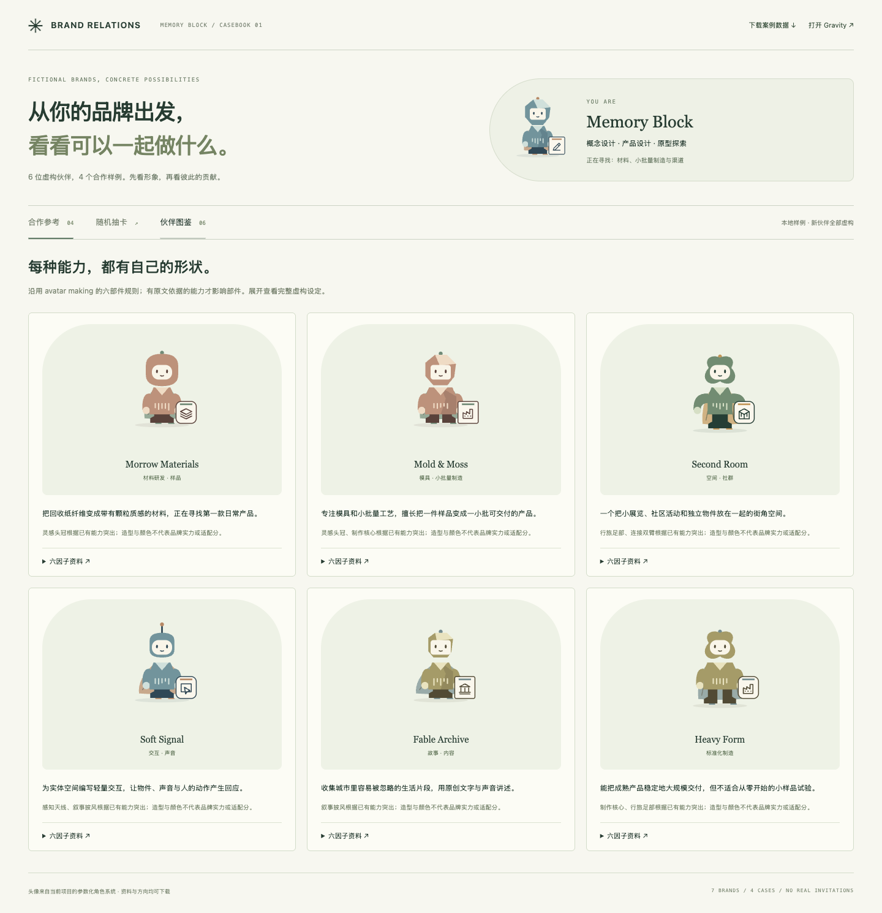

# Brand Relations Demo

探索品牌如何一起合作的开源实验：**Gravity 关系场 + 随机 Combo 抽卡 + 能力 Avatar + 合作诊断案例**。

React 19 · TypeScript · Vite · 原创参数化 SVG · MIT



## 快速运行

需要 Node.js 22.12+ 和 pnpm 10。

```sh
npm install --global pnpm@10.11.0
git clone https://github.com/KAI-NEX/brand-relations-demo.git
cd brand-relations-demo
pnpm install --frozen-lockfile
pnpm dev
```

- **Gravity 与形象工作室**：http://127.0.0.1:5173/
- **Memory Block 合作案例与随机 Combo**：http://127.0.0.1:5173/?view=cases

不配置 API 密钥也能运行全部本地规则、虚构案例、Gravity 和随机抽卡。

## 可以体验什么

| 模块 | 当前行为 |
| --- | --- |
| Gravity | 28 家虚构品牌，根据当前 Focus 展示关系距离；支持拖拽、缩放、查看原因与切换焦点 |
| Avatar | 六组能力映射到 SVG 部件；可以录入公司并生成本地候选，选择结果保存在浏览器 |
| 参考案例 | 你是 Memory Block，与 6 家虚构伙伴探索双品牌、三方、四方合作及规模不匹配反例 |
| 随机 Combo | 从六位伙伴中随机抽取；三方 = 你 + 两家伙伴，四方 = 你 + 三家伙伴；卡背显示 Avatar，揭晓后显示资料 |
| 合作诊断 | 消费者需求与拒绝理由、各方收益与承担、交付与问题责任；不再分配新百分比 |
| 邀请预览 | 编辑本地邀请草稿、收藏本次会话方向、导出案例 JSON |

案例页抽卡使用随机洗牌，不按 Fit 加权。同批成员不重复。主 Gravity 页原有 Discover 是按 Fit 排序的候选轮换，两者是不同实验入口。

品牌理解六因子与 Avatar 六部件不是同一套指标。原 Relation 基线保留 Intent 35%、Complementarity 30%、Audience Expansion 15%、Chemistry 15%、Feasibility 5%；这些是演示规则，不是已验证的合作成功概率。形象造型不参与评分。

## 测试和构建

```sh
pnpm typecheck
pnpm lint
pnpm test
pnpm build
```

GitHub Actions 在 push / pull request 时执行这些检查。静态产物位于 `dist/`。

## 可选 AI 形象生成

复制 `.env.example` 为 `.env.local`，填写自己的 `OPENAI_API_KEY`，重启开发服务。密钥只在本地服务端使用；不要使用 `VITE_` 前缀，不要提交实际环境文件。`OPENAI_MODEL` 可配置模型。

生成时会把用户提交的公司资料发送到 OpenAI。未配置时可使用明确标注的本地规则预览。AI 接口接在 Vite 开发 / preview 中间件中，静态 `dist/` 不包含接口。当前服务只适合本地演示；公开部署 AI 接口前需要实现身份验证、访问控制与用量限制。

## 项目结构

```text
src/cases/          六位虚构伙伴、合作参考、随机 Combo 页面
src/components/     Gravity、参数化形象与资料交互
src/engines/        关系评分、布局、视口和 Avatar 规则
src/data/           原始 28 家虚构品牌
src/domain/         类型与形象契约
server/             可选的本地 AI 适配器及测试
examples/           可独立复用的虚构品牌与案例 JSON/CSV
docs/               实现说明、动效参考、案例截图
```

更多细节见 [实现说明](docs/implementation-notes.md) 与 [动效参考](docs/motion-references.md)。实现说明保留各阶段测试记录；当前测试结果以 CI 为准。

## 当前边界

所有样例公司、能力、产能与合作方向均为虚构测试内容，不代表真实企业或已发生的合作。关系评分仍是 Mock 关键词规则，中文覆盖有限；诊断中的未知不等于失败。

当前没有真实邀请发送、多人同意、账号系统、群聊、合同或跨设备协作。邀请草稿只在页面中预览。真实 AI 账户调用没有作为发布验证的一部分，相关适配器使用模拟响应测试。

## 参与与许可

欢迎通过 Issue 提交问题或用 Pull Request 改进规则、可访问性与案例。请使用虚构或已经获得公开授权的资料，提交前运行上述四项检查。

项目代码和仓库内原创 SVG、虚构样例以 [MIT](LICENSE) 开源。依赖保留各自许可；参考链接中的第三方作品与商标不在本项目许可范围内。
